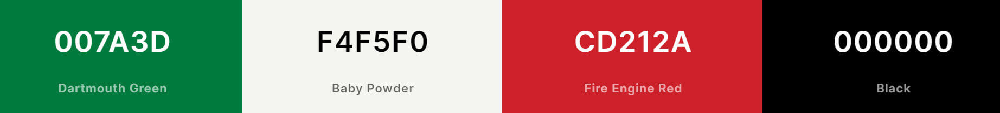
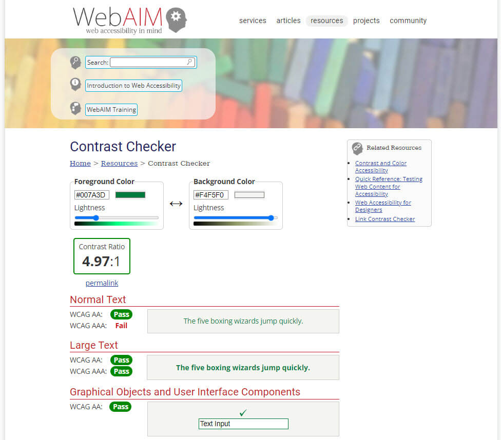
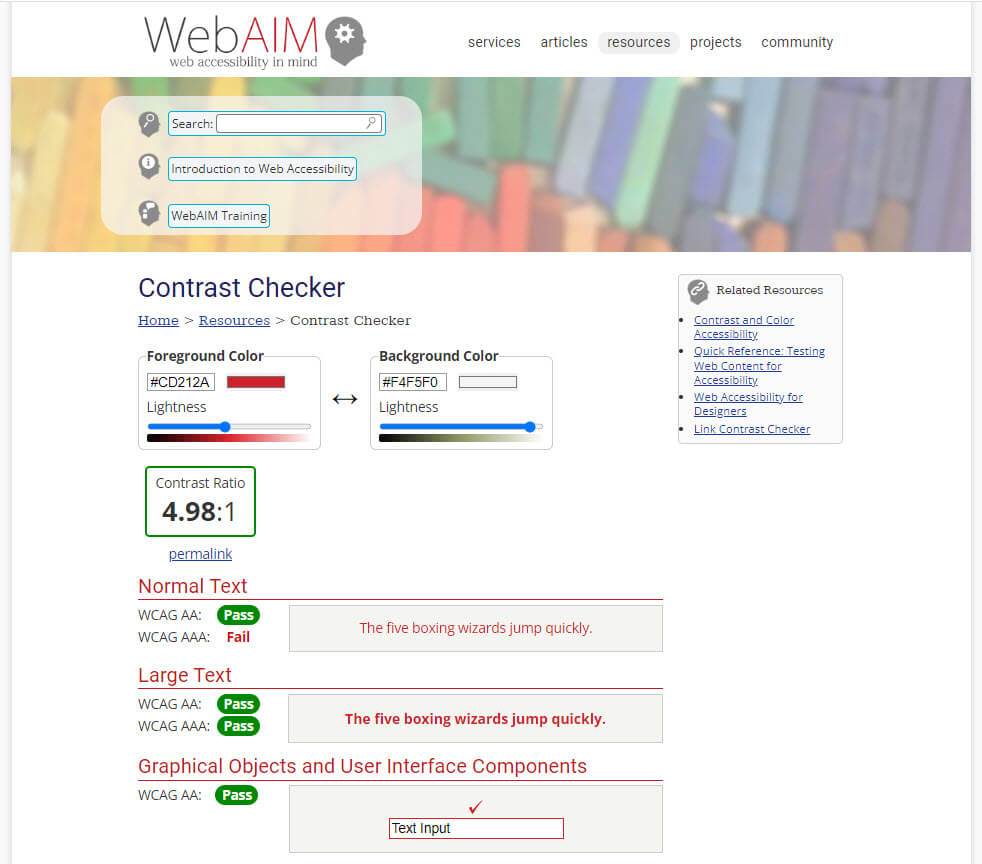

<h1 align="center">Meg's Italian Kitchen</h1>

<h3>Milestone Three Project - Python and Data Centric Development</h3>
 

**Please note: To open any links in this document in a new browser tab, press 'CTRL + Click'.**

# Table of Contents

<b>(click to expand or hide)</b>

<!-- Markdown TOC -->

1. [Description](#description)
2. [User Experience (UX)](#user-experience-(ux))
   * [User Stories](#user-stories)
   * [5 Planes](#5-planes)
     1. [Strategy](#strategy)
     2. [Scope](#scope)
     3. [Structure](#structure)
     4. [Skeleton](#skeleton)
     5. [Surface](#surface)
3. [Features](#features)
   * [Current Features](#current-features)
   * [Future Features](#future-features)
4. [Technologies Used](#technologies-used)
5. [Testing](#testing)
6. [Lessons Learned](#lessons-learned)
7. [Deployment](#deployment)
8. [Credits](#credits)

<!-- /Markdown TOC -->

# Description  

I am currently studying the Full Stack Development Course through Code Institute. Part of the course I am required 
to complete 4 milestone projects. Meg's Italian Kitchen is my 3rd milestone project which is part of the Python and Data Centric Development.  

Meg's Italian Kitchen has been created for all lovers of Italian food.  
The purpose of this website is to have a variety of Italian recipes display so people can create mouth watering meals. 
The website will also accommodate for users that would like to add new recipes and amend and delete their own recipes when needed.

[Back to Table of Contents](#table-of-contents)

# User Experience (UX)

## User Stories  

First Time Visitor Goals

* As a first time visitor to the website, I would like to:  
  * search for Italian recipes
  * view various Italian recipes
  * be able to have the opportunity to register so I can add new recipes to the database

Returning Visitor Goals

* As a returning user to the website, I would like to:
  * have the ability to log in so I can view my recipes
  * have the ability to search for recipes whilst logged in
  * have the ability to add a recipe
  * have the ability to amend the recipe as required
  * have the ability to delete my own recipes

[Back to Table of Contents](#table-of-contents)

## 5 Planes

### 1. Strategy

The purpose of this project is to create an online Italian cookbook where users can search and/or log in and add, amend and delete their own recipes.

### 2. Scope

The features of this project will include:

* The ability to:
  * search for Italian recipes
  * view all Italian recipes
  * register to add new recipes to the database
  * once registered to have a log in/out screen that the user can return to
  * view the users recipes that have been added by that user
  * add my own recipe
  * amend my recipe
  * delete my recipe

### 3. Structure

The information is grouped logically for all users. The Interaction Design (IXD) will be consistent between pages where the navigation bar is fixed and tailored to have the priority items displayed first at the top of the screen. The footer will scroll with the page. 
A user can either search and view all recipes and/or log in to add, amend, delete their own recipes.
The site will be consistent with what users expect from an online cookbook.

### 4. Skeleton

The [wireframes](./static/documents/wireframes/megs-italian-kitchen.pdf) have been created using [Balsamiq](https://balsamiq.com/) and were created 
for Desktop, Tablet and Phone.

After discussions with my Mentor, it was decided to remove a few pages such as Favourites, Entree, Dessert, Mains and Contact Us. This was due to time restraints and these items have been placed in for future features to implement. The final wireframes are as per below.

Here are the individual wireframes:

* [Home Page Wireframe](static/images/readme-images/wireframes/homepage.png)
* [Register Wireframe](static/images/readme-images/wireframes/register.png)
* [Log In Wireframe](static/images/readme-images/wireframes/login.png)
* [Add Recipe Wireframe](static/images/readme-images/wireframes/add-recipe.png)
* [My Recipes Wireframe](static/images/readme-images/wireframes/my-recipes.png)
* [Edit Recipe Wireframe](static/images/readme-images/wireframes/edit-recipe.png)
* [404 Error Wireframe](static/images/readme-images/wireframes/404-error.png)

### 5. Surface 

Colour Scheme

* I wanted to use the [Italian Flag colours](https://colorswall.com/palette/248) for this project, which are green - #008c45, off white - #f4f5f0 and red - #cd212a. 
* Unfortunately the green did not pass the accessibility test. I was able to use the off white and the red colour but had to change the green. The green was changed to #007A3D to comply with accessibility criteria.
* I have used the red and green colour throughout the project for the navigation bar, buttons and flash messages. All background colours of the buttons, header and recipe cards I have used the off white colour of the italian flag.
* The colours are well suited to the design of the site as if there is an error, the flash message will display in red and if everything works as intended then the flash message displays in green.
* All other text is black #000.

Colours sourced using [Coolors](https://coolors.co/007a3d-f4f5f0-cd212a-000000)

* The colours were checked through [WebAIM](https://webaim.org/resources/contrastchecker/) to ensure the final colours were accessible.

Typography

* The fonts were sourced from [Google Fonts](https://fonts.google.com/).
* Simonetta is used for all the headings with sans-serif as the fallback font. This font was 
chosen from an [Italian Fonts Google search](https://www.1001fonts.com/regular+italian+google-web-fonts.html).
* Open Sans is the main font used through the website with sans-serif as the fallback font. This font 
was chosen as Simonetta is a serif font and Open Sans is a sans serif font and these both compliment each other.

Imagery

* The homepage image was sourced from [freepik](https://www.freepik.com/free-photo/spice-pasta-lunch-top-fresh_1087766.htm#query=italian%20cuisine&position=2&from_view=keyword) - See Media in Credits for attribution.
* See [Credits](#credits) for all recipe images.

[Back to Table of Contents](#table-of-contents)

# Features

**Current Features**

**Future Features to implement**

* Add a recipe to favourites
* Delete a recipe from favourites
* Have recipes display in their own category, for eg: all entree meals are displayed on their own page, same for mains and desserts
* Review other peoples recipes
* Contact page - to ask questions if required to the site owner
* Change the icon colours once form is completed
* Be able to add ingredients one at a time by using a plus button, rather than pressing enter after every ingredient
* Be able to add recipe method (steps) one at a time by using a plus button, rather than pressing enter after each step

[Back to Table of Contents](#table-of-contents)

# Technologies Used

**Languages**

1. [HTML5](https://en.wikipedia.org/wiki/HTML5)
2. [CSS3](https://en.wikipedia.org/wiki/CSS)
3. [Python 3](https://www.python.org/)

**Databases**

1. [MongoDB Atlas](https://www.mongodb.com/)

**Frameworks and Libraries**

1. [DNSPython](https://www.dnspython.org/) - is a toolkit for Python
1. [Flask](https://palletsprojects.com/p/flask/) - is a lightweight WSGI web application framework
1. [Flask-PyMongo](https://flask-pymongo.readthedocs.io/en/latest/) - bridges Flask and PyMongo and provides some convenience helpers
1. [Jinja](https://jinja.palletsprojects.com/en/3.0.x/) - is a templating engine for Python
1. [jQuery](https://developer.mozilla.org/en-US/docs/Glossary/jQuery) - used to initialise the Materialize CSS components
1. [Materialize](https://materializecss.com/getting-started.html) - to make the website responsive and use custom components
1. [PyMongo](https://pymongo.readthedocs.io/en/stable/) - is a Python distribution containing tools for working with MongoDB
1. [Werkzeug](https://werkzeug.palletsprojects.com/en/2.1.x/) - is a comprehensive WSGI web application library and was used for security features

**Programs and Resources**

1. [Balsamiq](https://balsamiq.com/) - wireframes
1. [Code Institute Course Content](https://learn.codeinstitute.net/login?next=/) - main source of fundamental knowledge
1. [Img 2 Go](https://www.img2go.com/compress-image) - to compress the home page image
1. [Coolors](https://coolors.co/) - to display colour palette
1. [Font Awesome](https://fontawesome.com/v5/search) - for their icons
1. [Freepik](https://www.freepik.com/home) - for the home page image
1. [Git](https://git-scm.com/) - version control
1. [GitHub](https://github.com/) - used to store the project files
1. [Gitpod](https://www.gitpod.io/) - IDE
1. [Google Fonts](https://fonts.google.com/) - typography
1. [Heroku](https://id.heroku.com/login) - a container-based cloud Platform as a Service (PaaS) used to deploy the project 
1. [Snagit](https://www.techsmith.com/screen-capture.html) - screen capture and resizing images
1. [TinyPNG](https://tinypng.com/) - efficient compression of images for the site
1. [Unsplash](https://unsplash.com/) - for the standard recipe image
1. [WebAIM](https://webaim.org/resources/contrastchecker/) - web accessibility contrast checker

[Back to Table of Contents](#table-of-contents)

# Testing

[See Testing.md for testing information](TESTING.md)

[Back to Table of Contents](#table-of-contents)

# Lessons Learned

* That I can produce a functional website in a short amount of time
* You can have fun coding
* That I do know how to problem solve and I feel more confident in fixing bugs
* Not to give up when times are tough
* Seek help from other people when needed

[Back to Table of Contents](#table-of-contents)

# Deployment

**Run this site locally**

[Back to Table of Contents](#table-of-contents)

# Credits

Code

* Tutor Support for assistance in helping me understand some code
* Abi Harrison_alumna, for providing accessibility guidance
* My mentor for his guidance with the project
* [Stack Overflow](https://stackoverflow.com/) for resolving specific issues
* I followed the [Task Manager Application]((https://learn.codeinstitute.net/login?next=/)) walk through project from Code Institute for the CRUD functionality that was used in this project
* Change colour on Flash Messages: https://stackoverflow.com/questions/44569040/change-color-of-flask-flash-messages
* See Bugs/Fixes in the [TESTING.md](TESTING.md) for specific credits for code fixes

Content  

* All content was written by myself
* The recipes were sourced from 

Media  

* The home page image was sourced from [freepik.com](https://www.freepik.com/free-photo/spice-pasta-lunch-top-fresh_1087766.htm#query=italian%20cuisine&position=2&from_view=keyword). Attribution <a href='https://www.freepik.com/photos/pasta-background'>Pasta background photo created by valeria_aksakova - www.freepik.com</a>
* Once someone adds a recipe, they have the option to add an image URL. These cannot be credited in the Readme as the URL address is unknown to the author at the time of creating this Readme file.
* If a image URL is not added to the recipe, then a standard image displays. This image has been sourced from [Unsplash](https://unsplash.com/photos/ab8wP1U-rBg).

Acknowledgements

* My friends and family for all their feedback and support
* [Manni_alumnus](https://github.com/manni8436) for his continued support, feedback and keeping me motivated to finish
* [Abi Harrison_alumna](https://github.com/Abibubble) for our chats regarding accessibility
* My mentor for all his support and assistance

[Back to Table of Contents](#table-of-contents)