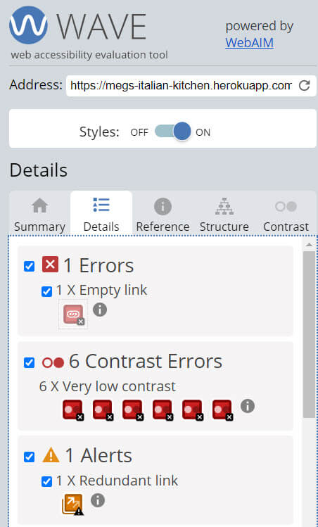

<h1 align="center">Meg's Italian Kitchen - Testing Details</h1>

[View the main README.md document](README.md)

[View the deployed Meg's Italian Kitchen]()

**Please note: To open any links in this document in a new browser tab, press 'CTRL + click'.**

# Table of Contents

<b>(click to expand or hide)</b>

<!-- MarkdownTOC -->

[Testing](#testing)
* [Validators](#validators)
* [Lighthouse](#lighthouse)
* [Wave Report](#wave)
* [User Stories](#user-stories)
* [Manual Testing](#manual-testing)
* [Bugs/Fixes](#bugs-fixes)

<!-- /MarkdownTOC -->

# Testing

Testing was conducted manually and through different validator services on each page of the website.

## Validators

* [W3C Markup Validation Service](https://validator.w3.org/#validate_by_uri) was used on each page to 
ensure that there were no errors or warnings in my HTML document. I originally used the Direct Input, 
however I was getting jinja errors, as the HTML didn't like the Jinja code in Direct Input. So I used 
the Validate by URI, which ignored the jinja code and gave me a true indication of any errors or warnings.

  * One warning displayed as per the below screenshot.

   * I spoke to Tutor Support regarding this error and they advised that I can ignore this error, as the error is referring to the "section" that is used for flash messages and will not contain any "heading" elements. 

  * No other errors or warnings displayed.  

  * Tutor Support also showed me the best way to validate html, which is to right click on the web page and select "view page source" and copy the code from there and paste into the direct input section of the html checker. This way the jinja code is ignored by the html checker.

* [W3C CSS Validation Service](https://jigsaw.w3.org/css-validator/#validate_by_input) was used to ensure that there were no errors or warnings in my CSS document and was validated by direct input. I had no errors or warnings display.

* [Autoprefixer CSS Online](https://autoprefixer.github.io/) was used to ensure that all vendor prefixes 
were included in CSS. the results were copied into the style.css file.

* [Pep8](http://pep8online.com/) was used to check the app.py file. No errors or warnings displayed.

[Back to Table of Contents](#table-of-contents)

## Lighthouse  

Lighthouse was used to check for any problems on all pages. Unfortunately the scores were not as high as I would have liked. My heart sunk, especially as due to time restraints I haven't been able to look into these issues. It is something that will be addressed once the course is finished and I have more time to spend on each issue. 

I did try to rectify one of the issues regarding image aspect ratio, where I installed "npm i --save-dev css-aspect-ratio" and imported the plain css using a cdn however that did not rectify the issue. I realise there is more that needs to be done and this will be addressed once the course is finished.

Below is the lighthouse score for each page on mobile and desktop:

<b>(click to expand or hide)</b>

### index.html - mobile

### index.html - desktop

### recipes.html - mobile

### recipes.html - desktop

### full_recipe.html - mobile

### full_recipe.html - desktop

### login.html - mobile

### login.html - desktop

### register.html - mobile

### register.html - desktop

### add_recipe.html - mobile

### add_recipe.html - desktop

### my_recipes.html - mobile

### my_recipes.html - desktop

### edit_recipe.html - mobile

### edit_recipe.html - desktop

[Back to Table of Contents](#table-of-contents)

## Wave Report  

* [Wave](https://wave.webaim.org/) was used to check for accessibility issues on all pages. Some errors have displayed such as empty links and contrast errors. The empty link is not an issue as it is to do with the mobile side nav. The contrast errors will be fixed after I finish the course due to time restraints.

Below is the wave report for each page:

<b>(click to expand or hide)</b>

### index.html

### recipes.html

### full_recipe.html

### login.html

### register.html

### add_recipe.html

### my_recipes.html

* Unfortunately Wave wouldn't accept a users own recipes. A Key Error displayed. This may have something to do with having to be logged in to view the page. Due to time restraints, this will be looked into once I have finished the course.

### edit_recipe.html

[Back to Table of Contents](#table-of-contents)

## User Stories 

### Testing User Stories from the UX section of [the main README.md document](README.md)

<b>(click to expand or hide)</b>

Each screenshot displays a red square around each item that is needed to achieve the testing criteria.

### First Time Visitor Goals

* As a first time visitor to the website, I would like to search for Italian recipes.
  * This is achieved by clicking the Browse link on the home page or the Recipes link in the nav bar. Once you are on the All Recipes page you can search by recipe title, course and ingredients.

* As a first time visitor to the website, I would like to view various Italian recipes.
  * This is achieved by clicking the Recipes link in the nav bar and scrolling through the recipes. The visitor has an option to view the full recipe details.

* As a first time visitor to the website, I would like to be able to have the opportunity to register so I can add new recipes to the database.
  * This is achieved by having a Register link on the home page and in the nav bar that allows the user to Register.

### Returning Visitor Goals

* As a returning user to the website, I would like to have the ability to log in so I can view my recipes.
  * This is achieved by clicking the Log In link on the nav bar, logging in and clicking My Recipes.

* As a returning visitor to the website, I would like to have the ability to search for recipes whilst logged in.
  * This is achieved by clicking the Recipes link in the nav bar. Once you are on the All Recipes page you can search by recipe title, course and ingredients.

* As a returning visitor to the website, I would like to have the ability to add a recipe.
  * This is achieved by clicking the Add Recipes link on the nav bar and adding details about the recipe.

* As a returning visitor to the website, I would like to have the ability to amend the recipe as required.
  * This is achieved by clicking the My Recipes link in the nav bar and clicking Edit on your recipe, making the necessary changes and saving the recipe.

* As a returning visitor to the website, I would like to have the ability to delete my own recipes.
  * This is achieved by clicking the My Recipes link in the nav bar and clicking Delete on your recipe.

[Back to Table of Contents](#table-of-contents)

## Manual testing of all elements and functionality on every page  

### Browsers tested:

### Devices tested:

| Page      | Section       | Action        | Expected Behaviour     | Result   |  
| --------- | ------------- | ------------- | ---------------------- | -------- |

 

## Bugs/Fixes  

**Font colour**

**1. Issue**:
I was wanting to change the font colour on the navbar and Flash Messages and was having problems in overriding the default settings in Materialize.
* **FIX**:
The only way I could rectify this was use the !important rule in my CSS. There may be another way to rectify this, but I found this worked.

**Home Page**

**1. Issue**:
I was having issues with my footer where the footer wouldn't stay at the bottom of the page.
* **Fix**:
I found a fix for this on [Stack Overflow](https://stackoverflow.com/questions/55541850/how-to-make-footer-stay-at-bottom-of-the-page-with-flex-box) where I changed the html and body height to 100%, display of flex and flex-direction of column.

**2. Issue**:
As I was using Materialize in my project, the class of container had its own style. I originally had the class of container in my base.html, so it could update every page. However, this was affecting my home page image and it wouldn't cover the whole page. I changed the container width to 100%, but then that affected every other page and I didn't want the recipe cards to have 100% width.
* **Fix**:
I removed the class of container from the base.html page and added it directly to the pages that I wanted to use that styling on. Then I could make my home page have a width of 100%.

**Full Recipes Page**

**1. Issue**:
I was having issues with the ingredients and steps displaying on one line each. All of my ingredients and steps were next to each other in a big row.
* **FIX**:
I searched Slack for other peoples recipe cookbooks and found [My Ruby's Kitchen](http://ms3-recipe.herokuapp.com/home) who had the ingredients and steps in the same way that I wanted the page to be laid out. I followed her code to organise my ingredients and steps on the page by using splitlines.

**Outstanding bugs**
On a mobile phone I have an extra [dropdown menu displayed in blue carots ^](./static/images/testing-images/edit-recipe-bug.jpg) on the Add Recipe and Edit Recipe pages. I am yet to find a way to remove these extra characters off the screen. As it doesn't affect the ability to complete the form, this bug will be further looked into at a later stage.